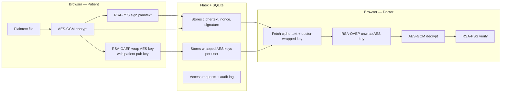

# Presentation Guide — Encrypted Medical Records Vault

Use this document as a slide outline or speaker notes when demoing or defending the assignment. It mirrors what the graders see in code and README, with extra intuition and a scripted flow.

---

## 1. One-sentence pitch

“A web medical-records vault where the **server never possesses plaintext documents or plaintext AES keys**; patients encrypt and sign in the browser, doctors decrypt only after the patient deliberately re-wraps the session key for them.”

---

## 2. Problem and threat model (what we worry about)

- **Honest-but-curious server:** The vault might be compromised or subpoenaed. We design so that **SQLite holds only ciphertext and wrapped keys**, not usable secrets by itself.
- **Authenticity:** A doctor should know the blob came from the patient and was not swapped in transit at the storage layer (within the limits of this demo — see limitations).
- **Access control:** A doctor cannot decrypt until the patient approves — implemented by **cryptographic key material**, not merely a UI flag alone (the ciphertext path still requires the patient’s cooperation to produce a doctor-wrapped key).

What this demo **does not** fully solve (say explicitly if asked):

- **XSS** exfiltrating keys from `sessionStorage`
- **Phishing**, **endpoint malware**, **legal coercion** at the endpoint
- **Metadata** protection (filenames and usernames appear in plaintext in the DB and API for this coursework)

---

## 3. High-level architecture

**Key idea:** The arrow from patient crypto into the server carries **only** what the server is allowed to see. The server never receives the raw file in clear form or the raw 256-bit AES key in clear form.

---

## 4. Cryptographic building blocks

| Mechanism | Role in this project |
|-----------|----------------------|
| **AES-256-GCM** | Fast, authenticated encryption of the file. Web Crypto appends the auth tag to the ciphertext blob; the app stores it as one base64 field (with a separate nonce/IV). |
| **RSA-OAEP (SHA-256), 2048-bit** | Wraps the random AES key for a specific user’s public key. Only the matching private key can unwrap. |
| **RSA-PSS (SHA-256), 2048-bit** | Patient signs the **original plaintext** (before encryption) so the doctor can verify integrity/authenticity after decryption. |

**Why hybrid?** AES handles large files; RSA only wraps a small key (and signing uses a separate RSA key pair in this codebase — encryption vs signing keys are both generated on register).

---

## 5. End-to-end flows (match the UI to the math)

### 5.1 Patient upload

1. User picks a file; browser reads bytes.
2. Generate random **AES key** + **nonce (IV)**; **encrypt** with AES-GCM → ciphertext (+ tag internally).
3. **Sign** the original plaintext with patient’s **RSA-PSS private** key → signature (base64).
4. **Wrap** the AES key with patient’s **RSA-OAEP public** key → encrypted_aes_key for patient.
5. POST JSON to `/api/upload_record` — server inserts **records** row and **record_keys** for the patient.

**Talking point:** “If you sniff the HTTPS body at the wrong layer or dump SQLite, you still only see opaque blobs unless you hold a private key.”

### 5.2 Doctor requests access

- Doctor clicks **Request Access**. Server inserts a pending row in **access_requests** — policy state only; no new crypto yet.

### 5.3 Patient approves (“proxy re-encryption pattern”)

1. Patient fetches **their** encrypted AES key for that record.
2. Browser **unwraps** with patient’s RSA-OAEP **private** key → raw AES key in memory only.
3. Fetch doctor’s **public** key from server.
4. **Re-wrap** the same AES key with doctor’s RSA-OAEP public key.
5. POST approval; server stores doctor’s wrapped key and marks request approved.

**Talking point:** “The plaintext AES key briefly exists only inside the patient’s browser. The server never gets that 256-bit value.”

### 5.4 Doctor download

1. Fetch ciphertext, nonce, signature, and **doctor’s** encrypted AES key.
2. **Unwrap** AES key with doctor’s private key.
3. **Decrypt** file.
4. **Verify** signature with patient’s **signing** public key.
5. If verification fails, the UI warns — tampering or mismatch.

---

## 6. `/status` — what it proves in a demo

The **Live status** page calls `GET /api/vault_status` on an interval.

- Shows **counts** (records, pending/approved requests, users).
- For each record: a **SHA-256 fingerprint** of the **stored ciphertext string** (first hex chars — cosmetic, still demonstrates “everything is opaque at rest”).
- **Relative bar** comparing approximate base64 ciphertext size.
- Lists **wrapped_key_holders** (usernames who have an RSA-wrapped AES key row) and access-request states.

**Slide line:** “This is intentionally metadata-only — no PHI in this view — but it makes the vault’s contents *visibly* cryptographic during the live demo.”

---

## 7. Backend surface (mental map)

Rough map of Flask routes:

- `POST /api/register` — store username, role, dual public key JSON (encryption + signing JWK bundles).
- `POST /api/upload_record` — persist ciphertext envelope + signature + patient’s wrapped key.
- `GET /api/records` — list metadata (doctor sees filenames and patient IDs; patient sees own files).
- `POST /api/request_access`, `GET /api/pending_requests`
- `GET /api/my_encrypted_key`, `POST /api/approve_access`
- `GET /api/download_record` — only if same user as patient OR approved doctor with a stored wrapped key.
- `GET /api/vault_status` — aggregate metadata for visualization.

SQLite tables: **users**, **records**, **access_requests**, **record_keys**, **audit_log**.

---

## 8. Recommended demo script (about 5–7 minutes)

| Step | Action | Say this |
|------|--------|-----------|
| 0 | Both servers running; open `/status` on projector | “Everything in the vault is opaque at rest — this page summarizes that.” |
| 1 | Patient device: register | “RSA key pairs generated **in-browser** with Web Crypto; private keys stay on the device in sessionStorage for this coursework.” |
| 2 | Doctor device: register | “Separate role — the server distinguishes users only by identity and policy, not by knowing file contents.” |
| 3 | Patient: upload dummy PDF/text | “Encrypt + sign locally; upload is ciphertext plus wrapped key.” |
| 4 | Point at `/status` | “Fingerprints and sizes update — still no PHI on this screen beyond filenames we deliberately store in the clear for the assignment.” |
| 5 | Doctor: Request Access | “Policy request — no decryption capability yet.” |
| 6 | Patient: Approve | “Patient browser unwraps AES key and re-wraps for doctor — classic proxy re-encryption **pattern**.” |
| 7 | Doctor: Download | “Unwrap, decrypt, verify signature — if someone tampered with ciphertext on the server, GCM or signature steps should fail or warn.” |
| 8 | Q&A | Refer to **Section 2** limitations honestly. |

---

## 9. Honest limitations (builds trust with markers)

- **sessionStorage** for long-lived private key material is convenient for a class demo and **not** a production security architecture.
- **Filenames and usernames** are stored and shown in plaintext — real systems might encrypt metadata or minimize display names.
- **Single server trust** — you still trust Flask not to ship malicious JS; E2EE in the browser always wrestles with “who serves the code.”
- Two separate RSA key pairs (wrap vs sign) increase complexity — good to mention when showing `cryptoUtils.js`.

---

## 10. Files worth opening live (if asked “show me the code”)

- `frontend/src/cryptoUtils.js` — Web Crypto primitives.
- `frontend/src/App.jsx` — upload / approve / download orchestration.
- `frontend/src/StatusPage.jsx` — visualization client.
- `app.py` — minimal API and `vault_status` aggregator.

---

## 11. Quick troubleshooting for presentation day

- **Blank errors / crypto fails:** Use **HTTPS** from Vite; Web Crypto restrictive contexts need a secure origin.
- **`/status` errors:** Confirm `python3 app.py` is running on port **5000** — Vite proxies `/api` only in dev.
- **Two phones:** Same Wi‑Fi + Vite `--host`; accept certificate warnings.

---

End of presenter guide — keep explanations aligned with **[README.md](README.md)** so documentation stays consistent.
